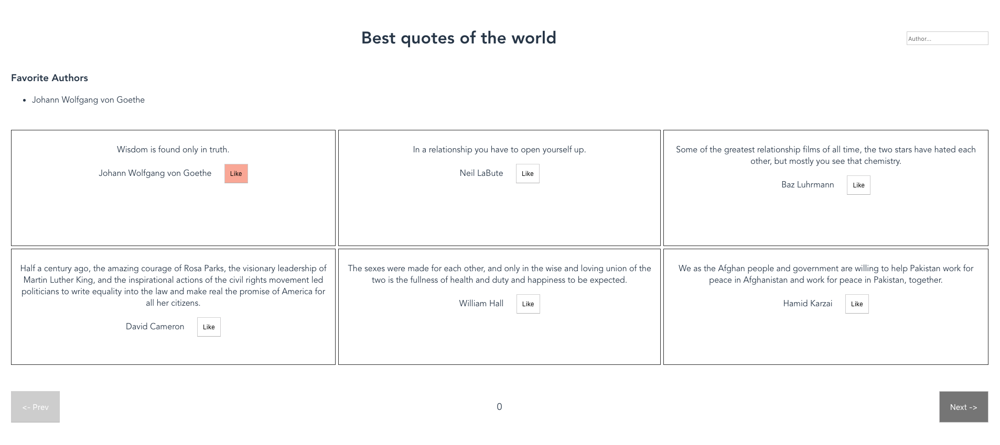

# Zenika pair programming interview - Vue.js Beginner

This beginner vue.js interview tests the candidate’s basic understanding of the vue.js concepts.

Topics: Quotes management system
The idea is to create a small web app that displays a list of quotes from a file. There are two buttons that acts like pagination to move between different pages. Every quote has a like button beside the author, to add the the author to a list of favorite authors.

We have two folders to work with. The correction is the folder with the solution to the problem. The workshop is the starting point for the candidate taking the interview.

Expected result:


## Preparation

Prerequisites: Nodes.js, npm installed

The candidate starts with following files:

```text
├── resources
│   ├── styles.css
│   ├── app.html
│   ├── favicon.ico
|── server
|   └── ...
|
|── readme.md
└── package.json
```

Create a project with the vue cli and copy the given files onto that folder.

## Suggested guideline:

### 1- Design choices

Discuss about the problem and ask how the candidate wishes to design the architecture of the app

### 2- Basics components

Create the different components

### 3- Binding inside and between components

Do the data bindings inside the components and between them using fake data using props and state

### 4- Retrieve Data

Use lifecycle hook to retrieve data from the server

### 5- Use retrieved data

Replace the fake data with the retrieved data from the server

### 6- Display multiple quotes

Use vue directives to display multiple quotes

### 7- Favorite Authors

Use event handling on the like button to add author to a list of Favorite authors.

### 8- Search bar for looking for Author
Use two-way data binding to create a search bar to search by authors for different quotes

### 9- Pagination

Use event handling and vue methods to use navigation button click event in order to display page number

### 10- Change color of the previous button

Use class bindings to change color of disabled back button and next button

After this, follow up with a discussion
